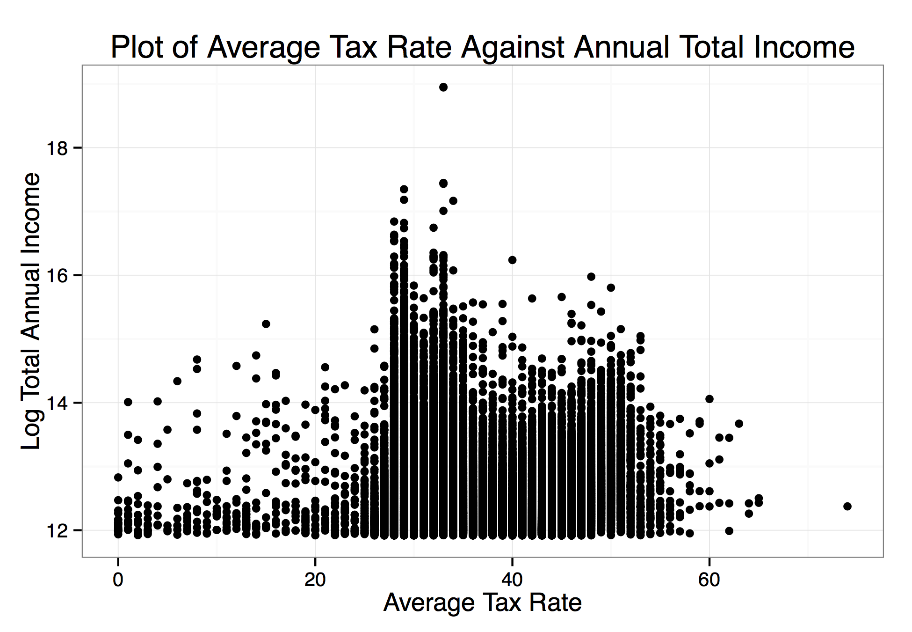

```{r, include=FALSE}
pkgs <- c('httr', 'dplyr', 'XML', 'ggplot2', 'stringr', 'car', 'devtools', 'rsdmx', 'stargazer', 'knitr', 'CausalImpact', 'tidyr', 'reshape2', 'sandwich', 'lmtest', 'plm')

setwd("/Users/Kyle/Dropbox/da_future/538/")
```

\pagebreak

#Introduction

Below you will see examples of my work created using Stata, R, and Gephi.

#Top Income Earners in Finland

I wrote a script in R that scraped data from Finland's most influential business newspaper. Since 2009, they have published Finland's top 15,000 income earners, inlcuding their name, gross earnings, and average tax rate. I then visually analyzed the data:




