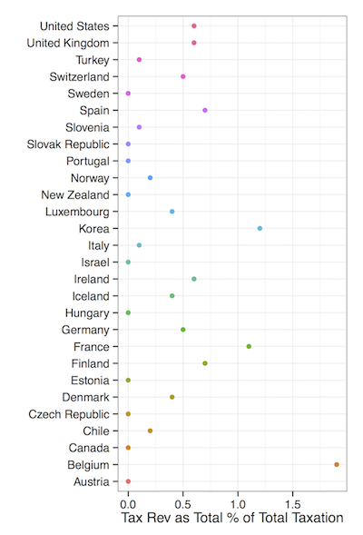
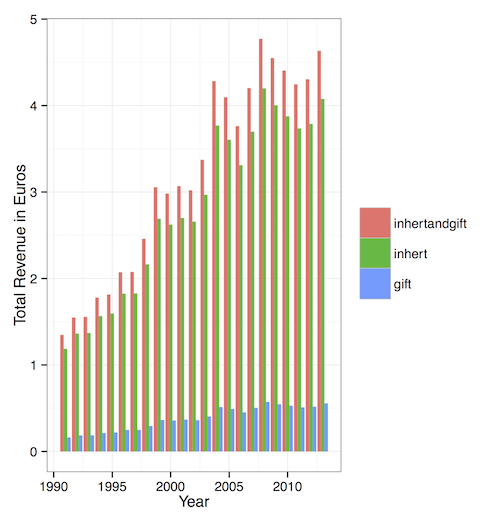

```{r, include=FALSE}
pkgs <- c('httr', 'dplyr', 'XML', 'ggplot2', 'stringr', 'car', 'devtools', 'rsdmx', 'stargazer', 'knitr', 'CausalImpact', 'tidyr', 'reshape2', 'sandwich', 'lmtest', 'plm')

setwd("/Users/Kyle/Dropbox/da_future/portfolio")
```

\pagebreak

#Introduction

Below you will see examples of my work created using Stata, R, and Gephi.

# Social Network Analysis Centered on New York Primary

Looking at the two populist campaigns of Sanders and Cruz, I downloaded millions of tweets during the days leading up to the New York Primary. I then conducted a network analysis using Gephi and also created simple word clouds of the top hashtags for each campaign. Note that the Gephi files are incredible large and detailed, which is why I have chosen to upload them as PDFs.


![Sanders Twitter network looking at communication between from- to to-users. Each color represents a different community with node size labels based on relative magnitude of in-degree measurement. Some communities to highlight: the @berniesanders network is in purple, @hillaryclinton in blue, @bkforbernie in bright pink, and @susnsarandon in dark grey. Importantly, @jordanchariton's community is in green. Chariton had the most retweeted tweet, which contained detailed information how to vote with an emergency provisional ballot](newmedia2.pdf)

#Top Income Earners in Finland

I wrote a [script in R ](https://github.com/kylejott/Final_Project/blob/master/data_scraping.R) that scraped data from Finland's most influential business newspaper. Since 2009, they have published Finland's top 15,000 income earners, including their name, gross earnings, and average tax rate. I then visually analyzed the data below and wrote an academic paper with a co-author found [here](https://github.com/kylejott/Final_Project/blob/master/final_paper.pdf).


#Inheritance Taxation Graphics







